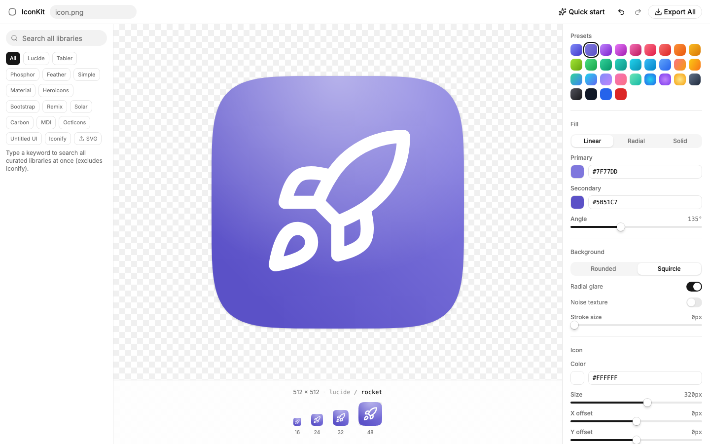

# IconKit

> 给 Web 开发者的「快速图标生成器」—— 设计一次图标，一键导出某个场景需要的整套文件 + 可直接粘贴的样板代码。

复刻 [ray.so/icon](https://ray.so/icon) 的「字形 + 渐变背景」体验，并针对真实痛点做了关键升级：把导出后的脏活（favicon 全套、apple-touch-icon、各尺寸 PNG、`manifest`、`<head>` 标签）全部自动化。**从打开到拿到一套可用 favicon，30 秒内、零手动改尺寸、零写样板代码。**



## ✨ 特性

- **三栏编辑器**：左侧图标库 · 中间画布 + 多尺寸实时预览 · 右侧全套调参
- **超多图标源**：Lucide（内置）+ Tabler / Phosphor / Feather / Simple Icons / **Google Material Symbols** / Heroicons / Bootstrap / Remix / Solar / Carbon / MDI / Octicons（按需 CDN 加载）+ **Iconify**（20 万+ 聚合搜索）+ **上传自定义 SVG**（自动清洗脚本/外链）
- **「全部」跨库搜索**：一个关键词，分组搜遍所有本地图标库
- **完整调参**：线性/径向/纯色渐变、31 套配色预设、iOS 超椭圆（squircle）背景、径向高光、噪声、描边、字形大小/偏移
- **高清导出**：每个尺寸都从矢量在**精确目标像素原生栅格化**，小尺寸不糊
- **四个导出目标**，各产文件 + 可一键复制的配套代码：
  | 目标 | 文件 | 配套代码 |
  |---|---|---|
  | **Favicon** | `favicon.ico` · `icon.svg` · `apple-touch-icon.png` · `icon-192/512.png` · `manifest.webmanifest` | 4 行 `<head>` + manifest |
  | **iOS App** | `AppIcon-1024.png`（方形、无 alpha、不预先圆角） | Xcode 拖入说明 |
  | **Extension** | `icon-16/32/48/128.png` | `manifest.json` 的 `icons` |
  | **Single** | 单张 PNG（自定义尺寸） | 复制 图片 / SVG / dataURL |
- **极速入口**：输入项目名 → 关键词确定性匹配字形 + hash 配色 → 一键成图（无图像生成模型）
- **撤销/重做 + 刷新不丢**（历史持久化到 localStorage）、**暗色模式**、纯前端可静态部署

## 🛠 技术栈

Vite · React 19 · TypeScript · Tailwind CSS v4 · shadcn/ui（base-ui）· JSZip · Vitest

数据流：单一中心状态 `IconState` → 纯函数 `buildMasterSVG()` 产出 512 viewBox 主 SVG → `rasterize` 派生各尺寸 PNG → `wrapAsICO` 产 `favicon.ico` → 拼 manifest/片段 → JSZip 打包下载。全程纯前端，无后端、无上传、可离线（默认 Lucide）。

## 🚀 开发

```bash
pnpm install
pnpm dev        # 本地开发
pnpm build      # 生产构建（tsc -b && vite build，输出 dist/）
pnpm test       # 单元测试（vitest）
pnpm typecheck  # 类型检查
pnpm lint       # ESLint
```

## 📁 关键目录

```
src/
  state/iconStore.tsx        # 中心状态 + undo/redo + localStorage 持久化
  lib/
    render/buildMasterSVG.ts # 纯函数：主 SVG（唯一真相来源）
    render/rasterize.ts      # SVG → 目标尺寸原生栅格化 → PNG
    render/wrapAsICO.ts      # PNG-in-ICO 字节封装
    icons/                   # 各图标源加载器（lucide / CDN / iconify / untitled）+ 归一/清洗
    export/                  # 四目标 bundle 编排 + JSZip
  components/layout/         # TopBar / LeftPicker / CenterCanvas / RightControls / ExportPanel / QuickStart
```

## ⚖️ 关于图标版权

各图标库遵循各自的开源协议（多为 MIT / Apache-2.0 / CC）。**Simple Icons 是品牌 logo**，适合 demo / 占位，正式发布产品 logo 请注意商标风险。上传的 SVG 仅在浏览器本地处理，不会上传。
